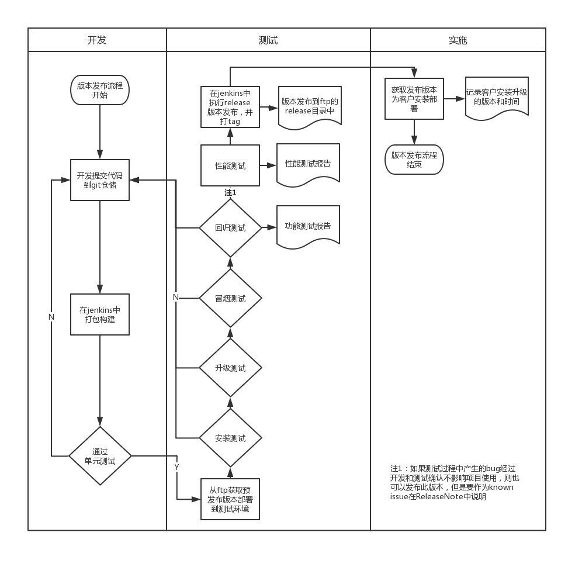

= LDB版本发布流程管理
manyi
:doctype: article
:encoding: utf-8
:lang: zh
:toc:
:numbered:

==  目的
为了有效控制和追踪产品的版本，保证产品一致性，可追溯性。

== 范围
适用于聚云技术部研发测试的所有数据库产品。

== 人员

=== 开发人员
根据产品需求进行功能开发，提交代码到git仓储，执行并验证单元测试。

=== 测试人员
根据产品需求进行测试分析，测试用例设计和测试执行，验证功能是否正确，性能是否满足要求。

=== 实施人员
从测试人员提供的版本发布地址获取需要的产品版本，为客户或项目使用，并编写安装升级记录。

== 产品发布流程

由开发负责人确认本次版本中包含的功能，通过issue的形式编入milestore中。

发布流程图如下：

