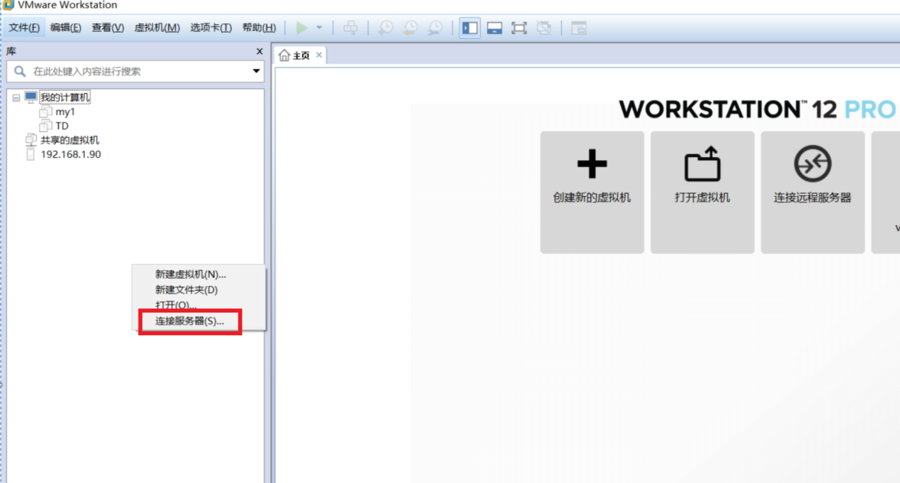
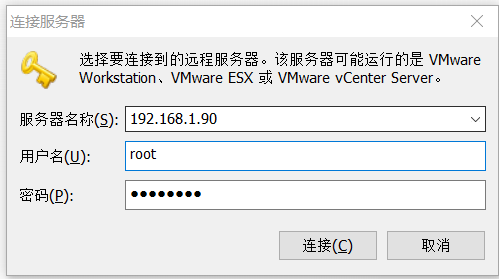
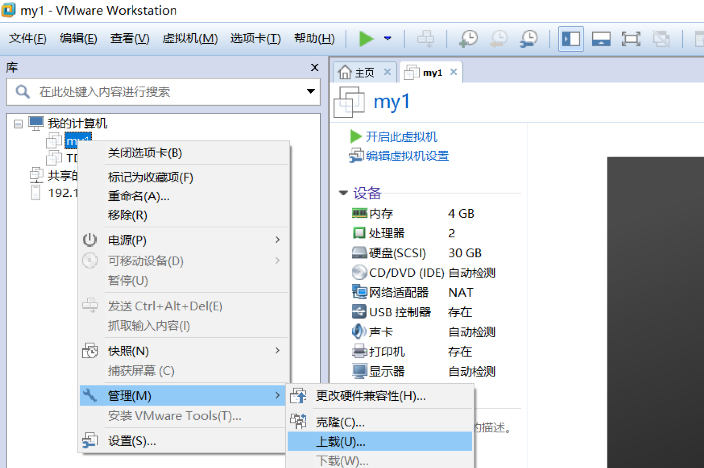
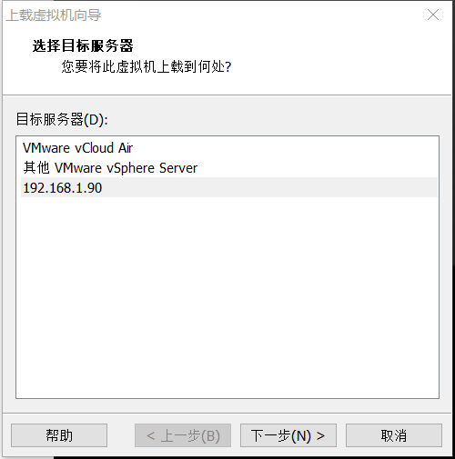
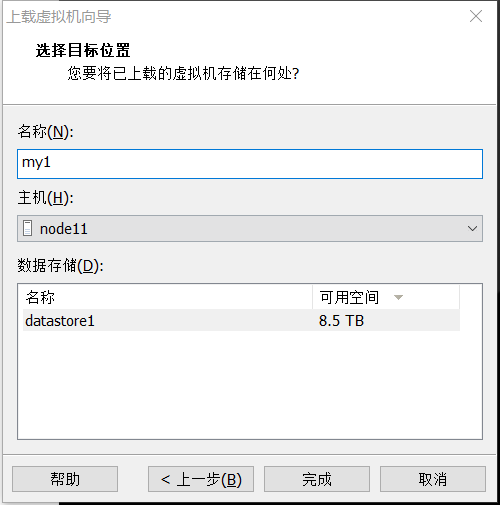
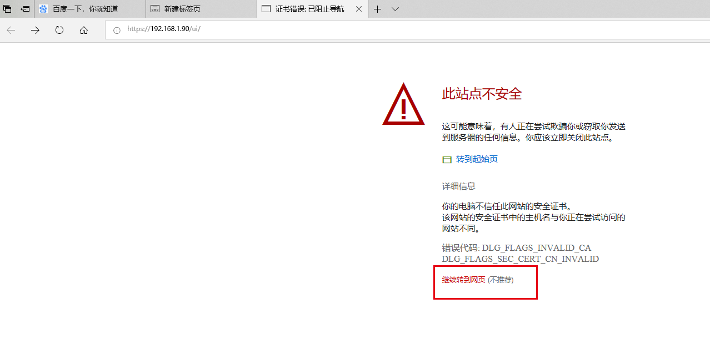
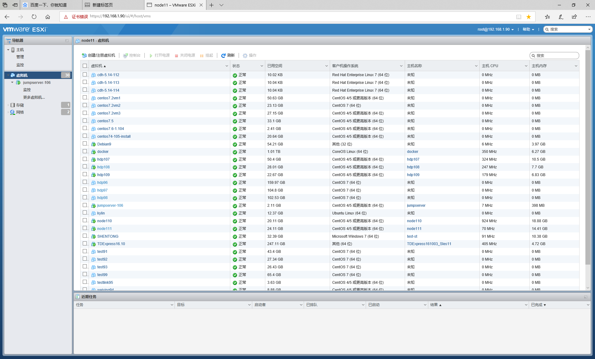

= 如何将本地虚拟机上传到192.168.1.90的ESXI中
manyi
:doctype: article
:encoding: utf-8
:lang: zh
:toc:
:numbered:

== 1

打开vmware workstation，在左边空白处单击鼠标右键-连接服务器

服务器名称：192.168.1.90 +
用户名：root +
密码：vmware@123 +
点击连接

== 2
选择要上传的虚拟机，点击鼠标右键-管理-上载

选择192.168.1.90，点击下一步

修改名称，点击完成即可。

= EXSI UI

通过EXSI页面查看各个虚拟机状态： +
使用IE浏览器访问https://192.168.1.90/ui/

输入用户名密码： +
root +
vmware@123 +

点击左边快捷栏-虚拟机 +

